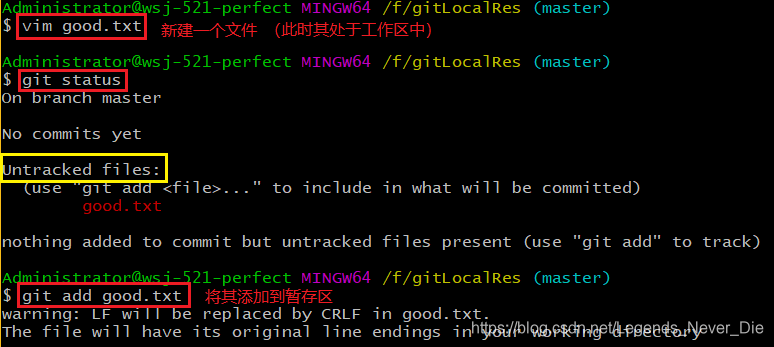
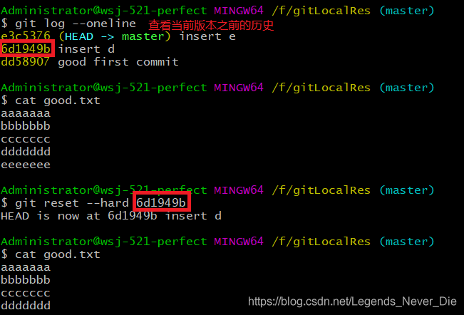
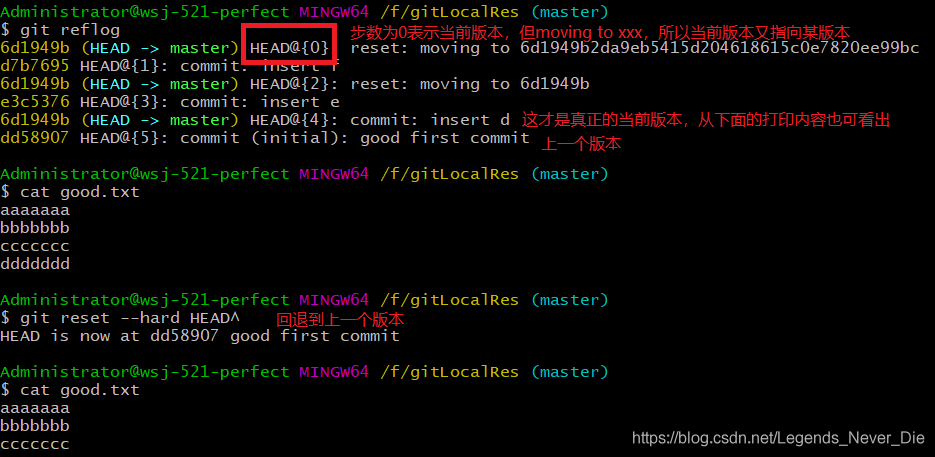
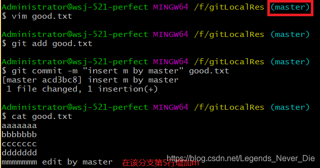
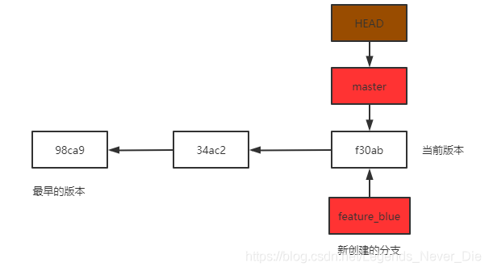
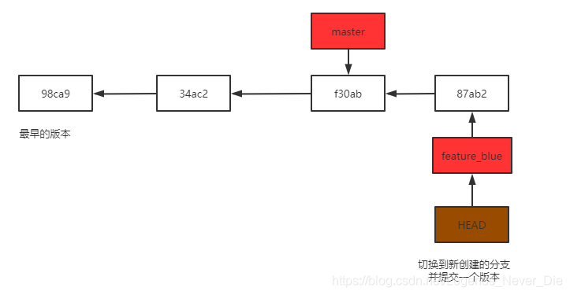

## 状态查看操作

> 查看工作区、暂存区的状态：**git status**
>
> 
>
> **本地库目录下的文件最原始都处于工作区之中，将其添加到暂存区，Git才会对其进行追踪**

##  

## 添加操作

> 将工作区的“新建/修改”添加到暂存区：**git add [fileName]**
>
> 
>
> 此时，再次查看状态：
>
> 

##  

## 提交操作

> 将暂存区的内容提交到本地库：**git commit -m "commit message" [fileName]**
>
> 

##  

## 查看历史版本

> 1、**git log**
>
> 
>
> 多屏显示控制方式：space 向下翻页，b 向上翻页，q 退出
>
> 2、信息简要显示：**git log --pretty=oneline**
>
> 
>
> 3、信息简要显示：**git log --online**
>
> 
>
> **注：上图中的字符串dd56807xxx是HEAD指针所指向的当前历史版本的系统快照的哈希索引值，该索引的局部表示（这里是前7位）常用来进行版本之间的切换**
>
> 4、**git reflog**(**常用****)**   **注：以上三种方式只能看到当前版本之前的历史，而该方式可以看到所有历史版本**
>
> 
>
> HEAD@{移动到当前版本需要多少步}

## 版本的前进后退

> 版本前进后退的本质：每个版本都是以快照的形式存在，Git通过对HEAD指针的移动对版本进行控制
>
> **方式：**
>
> 1、基于hash局部索引值操作[推荐]：**git reset --hard [目标版本的局部索引值]**
>
> 
>
> 2、使用^，（只能后退）：**git reset --hard HEAD^**
> **注：如果没有^，表示回退到当前版本；一**
>
> 
>
> **个^表示后退一步，n个表示后退n步**
>
> 
>
> 3、使用~，（只能后退）：**git reset --hard HEAD~n**
>
> **注：表示后退n步****，第2种方式的简化**

## **删除文件并找回**

> 前提：删除前，文件存在时的状态提交到了本地库
>
> 操作：使用历史版本进行回退即可

## 分支管理

### 什么是分支

> 在版本控制中，使用多条线路同时推进多个任务，每条线路就是一个分支
>
> 

### 分支的好处

> 1、可以同时并行推进多个功能开发、提高工作效率
>
> 2、各个分支在开发过程中，如果某一个分支开发失败，不会对其他分支有任何影响，失败的分支删除重新开始即可

### 分支操作

> 创建分支：**git branch [分支名]**
>
> 
>
> 查看分支：**git branch -v**
>
> 
>
> 切换分支：**git checkout [分支名]**
>
> ****
>
> **合并分支+解决冲突(可能会出现)：**
> 第一步：切换到接受修改的分支(一般为master)：git checkout [被合并分支名]
>
> 第二步：执行merge命令：git merge [有新内容的分支名]
>
> 
>
> 
>
> **Git是按行为单位进行比对，所以再将feature_blue合并到master上时会发生冲突**
>
> 
>
> **冲突的解决：**
>
> 第一步：编辑文件，删除特殊符号
>
> 第二部：把文件修改到满意的程度，保存退出
>
> 第三步：git add [fileName]
>
> **第四步：git commit -m "日志信息"** 
>
> **注：第四步提交到本地库时不带文件名**

### Git分支机制

> **其实就是指针的创建和移动**
>
> ****
>
> ****
>
> ****