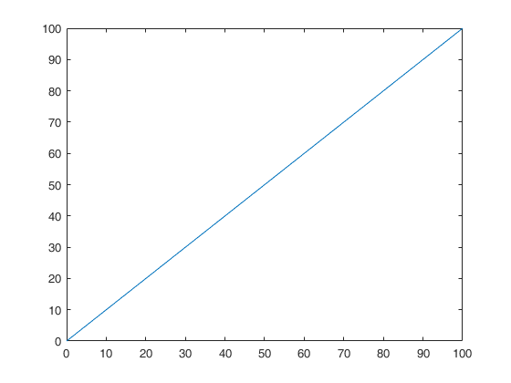
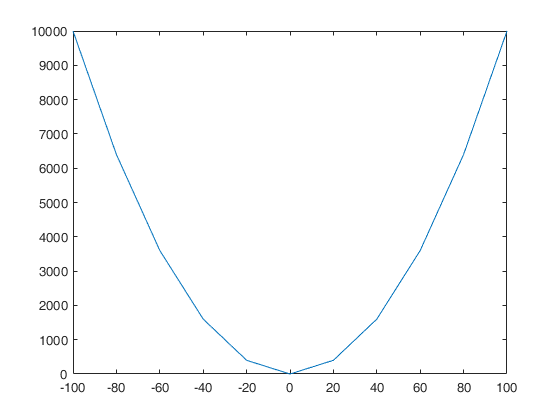
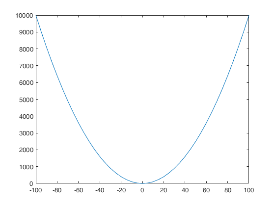
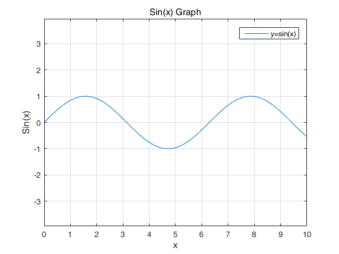
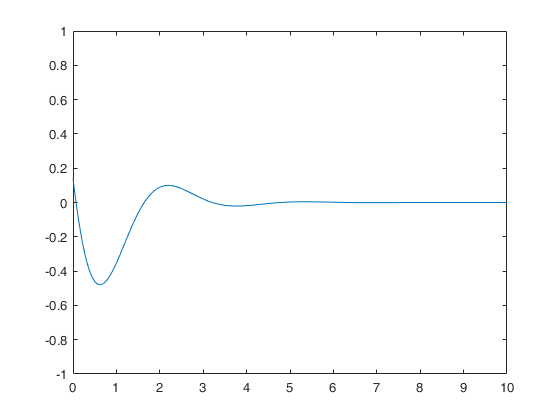
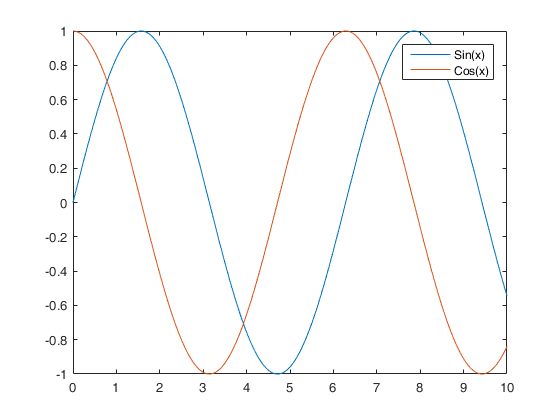
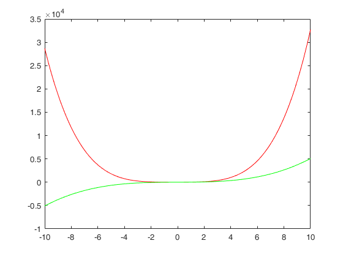
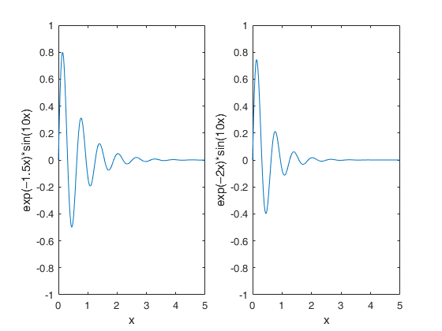

> matlab绘图比matplotlib更加简便，直接使用plot()进行绘图

## 示例

### 简单示例1    y=x

```matl
x = [0:5:100];
y = x;
plot(x, y)
```

 

### 简单示例2  y=x^2

``` matla
x = [-100:20:100];
y = x.^2;
plot(x, y)
```

 

减少值的增量，图像将会变得圆滑：

``` matlab
x = [-100:5:100];
y = x.^2;
plot(x, y)
```

 

## 标题，标签，网格线，图例

```matlab
x = [0:0.01:10];
y = sin(x);
plot(x, y), xlabel('x'), ylabel('Sin(x)'), title('Sin(x) Graph'),
grid on,legend('y=sin(x)')
```

 

## 轴等于

引用上述代码

``` matlab
x = [0:0.01:10];
y = sin(x);
plot(x, y), xlabel('x'), ylabel('Sin(x)'), title('Sin(x) Graph'),
grid on,legend('y=sin(x)'),axix equal
```

 

> `axix equal`命令使得x,y轴单位距离刻度取值相同


## 设置轴刻度范围

> 该轴命令允许您设置轴的刻度，您可以提供的最小值和最大值的 x 和 y 轴，使用轴命令的方式如下：
>
> - axis ( [xmin xmax ymin ymax] )

``` matlab
x = [0 : 0.01: 10];
y = exp(-x).* sin(2*x + 3);
plot(x, y), axis([0 10 -1 1])
```

 

## 同一个图上绘制多个函数

``` matlab
x = [0 : 0.01: 10];
y = sin(x);
g = cos(x);
plot(x, y, x, g), legend('Sin(x)', 'Cos(x)')
```

 


### 曲线颜色设置

|  Color  | Code  |
| :-----: | :---: |
|  White  | **w** |
|  Black  | **k** |
|  Blue   | **b** |
|   Red   | **r** |
|  Cyan   | **c** |
|  Green  | **g** |
| Magenta | **m** |
| Yellow  | **y** |

示例：

> 1. f(x) = 3x4 + 2x3+ 7x2 + 2x + 9
> 2. g(x) = 5x3 + 9x + 2

```matlab
x = [-10 : 0.01: 10];
y = 3*x.^4 + 2 * x.^3 + 7 * x.^2 + 2 * x + 9;
g = 5 * x.^3 + 9 * x + 2;
方法一：
plot(x, y, 'r', x, g, 'g')
方法二：
plot(x,y,'r');
hold on,plot(x,g,'g');
```

 


### 曲线线形设置

> `plot(x,y,'--')`  设置虚线
>
> `plot(x,y,'--r')` 同时设置虚线和红色
>
> - '-' 实线 '--' 虚线
>   ':' 点线 '-.' 点划线


## 生成子图

> 即同一个画布上产生多个绘图区
>
> MATLAB 中使用 subplot 命令创建子图
>
> - subplot(m, n, p)
>   - m：行数
>   - n：列数
>   - p：第p个

示例：

让我们生成下述的两个图：

- y = e−1.5xsin(10x)
- y = e−2xsin(10x)

```matlab
x = [0:0.01:5];
y = exp(-1.5*x).*sin(10*x);
subplot(1,2,1)
plot(x,y), xlabel('x'),ylabel('exp(–1.5x)*sin(10x)'),axis([0 5 -1 1])
y = exp(-2*x).*sin(10*x);
subplot(1,2,2)
plot(x,y),xlabel('x'),ylabel('exp(–2x)*sin(10x)'),axis([0 5 -1 1])
```

 