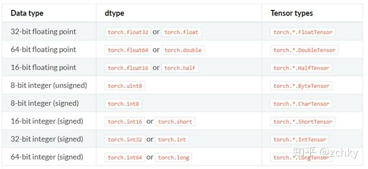
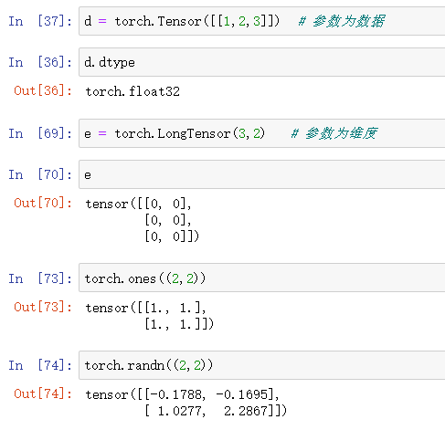

# Tensor与Ndarray相互转换

- `torch.from_numpy()`
- `a.numpy()`


# 数据操作

- 8种数据类型（int 5种，float 4种）

 

- 默认创建的Tensor数据类型为float32

## 查看Tensor数据类型

- Tensor.dtype
  - 现实的Tensor中每个数值的具体类型
- Tensor.type()
  - 该方法可以显示Tensor是否在GPU上

## 将Tensor移至GPU

```python
a = torch.Tensor(1.1)
a = a.cuda()   # 等价于 a = a.to('cuda')   ，默认是放到第一块GPU卡cuda:0上
```


## 创建Tensor

- torch.Tensor(数据)
- torch.LongTensor(形状)    # 生成的数据都是未初始化的随机数，有的数很大，有的数很小
- torch.ones(形状)
- torch.zeros(形状)
- torch.eye(形状)
- torch.randn(形状)     从均值为0，方差为1的正态分布数据取样
- torch.normal(mean=,std=)   从相互独立的正态分布中分别取样
  -  
  - -0.0209是从均值为1，方差为1的正态分布取样；3.2177是否均值为2，方差为0.9的正态分布取样...
- torch.rand(形状)    从[0,1]均为分布中随机取样
- torch.randint(low=0,high,size)    从[low,high)中整数取样
  - `torch.randint(high=100,size=(10,1))`  # 生成10个标签，范围：[0,100)
- torch.full(形状,7,dtype=torch.float32)   生成数据全是7的Tensor
- torch.arange(0,10,2)  生成[0,10)公差为2的等差数列
- torch.linspace(0,10,steps=4) 生成0-10的4个数构成的等差数列
- torch.logspace(1,2,steps=4) 生成起始值为10\^1，终止值为10\^2的4个数构成的等比数列
  -  
- torch.randperm(4)  从0开始生成4个自然数0，1，2，3。每次执行生成的自然数顺序会不同
  - 可以用来交换行之间或列之间的数据
  -   

 

## Tensor常用属性和方法

### 形状

- torch.shape
- torch.size()

### 维度

- torch.dim()

### 元素数量

- torch.numel()


 


# 加载数据集

> 使用Pytorch读取图片，主要是通过`Dataset`类，该类作为所有datasets(自定义的类)的基类存在，所有的datasets都要继承它，类似与C++中的虚基类
>
> - 源码
>
>   ```python
>   class Dataset(object):
>   """An abstract class representing a Dataset.
>   All other datasets should subclass it. All subclasses should override
>   ``__len__``, that provides the size of the dataset, and ``__getitem__``,
>   supporting integer indexing in range from 0 to len(self) exclusive.
>   """
>   	def __getitem__(self, index):
>   		raise NotImplementedError
>   	def __len__(self):
>   		raise NotImplementedError
>   	def __add__(self, other):
>   		return ConcatDataset([self, other])
>   ```
>
>   所有datasets类必须实现上述的getitem方法和len方法

读取自己数据的基本流程：

- 制作存储了图片路径和标签信息的txt
- 将这些信息转化为list，该list每一个元素对应一个样本
- 通过getitem函数读取数据和标签，并返回数据和标签

因此，要让Pytorch读取自己的数据集，只需两步：

- 制作图片数据的索引(路径)
- 构建Dataset子类

## 使用Dataset读取数据的标准流程

```python
# coding: utf-8
from PIL import Image
from torch.utils.data import Dataset


class MyDataset(Dataset):
    def __init__(self, txt_path, transform=None):   #transform用于数据的预处理(增强，标准化)
        fh = open(txt_path, 'r')
        imgs = []
        for line in fh:
            line = line.rstrip()
            words = line.split()
            imgs.append((words[0], int(words[1])))  # 每个元素为1个样本的路径和标签

        self.imgs = imgs        # 最主要就是要生成这个list， 然后DataLoader中给index，通过getitem读取图片数据
        self.transform = transform
        fh.close()

    def __getitem__(self, index):
        fn, label = self.imgs[index]
        img = Image.open(fn).convert('RGB')     # 像素值 0~255，在transfrom.totensor会除以255，使像素值变成 0~1. img类型为PIL.Image,必须将其转为Tensor

        if self.transform is not None:
            img = self.transform(img)   # 在这里做transform，转为tensor等等

        return img, label

    def __len__(self):
        return len(self.imgs)
```

> 当 Mydataset 构建好，剩下的操作就交给 DataLoder，在 DataLoder 中，会触发Mydataset 中的 getiterm 函数读取一张图片的数据和标签，并拼接成一个 batch 返回，作为模型真正的输入
>
> - DataLoader返回的batch包括两部分：1、图片数据：（batch_size，C，H，W） 2、标签：(batch_size,)

## 数据预处理

> 在实际应用过程中，我们会在数据进入模型之前进行一些预处理，例如数据中心化(仅减均值)，数据标准化(减均值，再除以标准差)，随机裁剪，旋转一定角度，镜像等一系列操作。PyTorch 有一系列数据增强方法.
>
> 在 PyTorch 中，这些数据增强方法放在了 transforms.py 文件中。这些数据处理可以满足我们大部分的需求

看如下代码：

```python
# 数据预处理设置
# 对RGB三个通道数据分别进行标准化,均值和方差要实际进行计算得到
normMean = [0.4948052, 0.48568845, 0.44682974] # 均值 RGB
normStd = [0.24580306, 0.24236229, 0.2603115] # 均方差 RGB
normTransform = transforms.Normalize(normMean, normStd)
# 将需要进行的处理compose起来，注意顺序：随机剪裁 -> toTensor(必) -> 标准化
trainTransform = transforms.Compose([    
    # 更改每个图片大小为32*32，使用插值法
    transforms.Resize(32),
    # 对每一个图片周围填充4个像素，值为0，在随机进行32*32的裁剪
    transforms.RandomCrop(32, padding=4), 
    # toTensor()做三件事，1、将图片类型转为Tensor 2、将图片维度由h*w*c转为c*h*w 3、所有像素/255，归一化为[0,1]
    transforms.ToTensor(),
    normTransform
])

validTransform = transforms.Compose([
    transforms.ToTensor(),
    normTransform
])

# 构建MyDataset实例
train_data = MyDataset(txt_path=train_txt_path, transform=trainTransform)
valid_data = MyDataset(txt_path=valid_txt_path, transform=validTransform)
```

### RGB各通道均值和标准化计算

```python
# coding: utf-8

import numpy as np
import cv2
import random
import os

"""
    随机挑选CNum张图片，进行按通道计算均值mean和标准差std
    先将像素从0～255归一化至 0-1 再计算
"""


train_txt_path = os.path.join("..", "..", "Data/train.txt")
# print(train_txt_path) ..\..\Data/train.txt
CNum = 2000     # 挑选多少图片进行计算

img_h, img_w = 32, 32
imgs = np.zeros([img_w, img_h, 3, 1])
# print(imgs.shape)  (32, 32, 3, 1)
means, stdevs = [], []

with open(train_txt_path, 'r') as f:
    lines = f.readlines()  # lines为list，每个元素为一行
    random.shuffle(lines)   # shuffle , 随机挑选图片

    for i in range(CNum):
        img_path = lines[i].rstrip().split()[0]

        img = cv2.imread(img_path)
        # print(img.shape)  H,W,C
        # print(type(img))  numpy.ndarray
        img = cv2.resize(img, (img_h, img_w))
        # print(img.shape) img_h,img_w,c_origin
        img = img[:, :, :, np.newaxis]
        # print(img.shape)  H,W,C,1
        imgs = np.concatenate((imgs, img), axis=3)
        # print(imgs.shape) H,W,C,CNum+1
        # print(i)

imgs = imgs.astype(np.float32)/255.     # 像素归一化
# print(imgs.shape) H,W,C,CNum+1

for i in range(3):
    pixels = imgs[:,:,i,:].ravel()  # 拉成一行
    means.append(np.mean(pixels))
    stdevs.append(np.std(pixels))

means.reverse() # BGR --> RGB
stdevs.reverse()

print("normMean = {}".format(means))
print("normStd = {}".format(stdevs))
print('transforms.Normalize(normMean = {}, normStd = {})'.format(means, stdevs))
```


- example

``` python
from torch.utils.data import Dataset
from torch.utils.data import DataLoader

# 自定义数据集类，继承Dataset抽象类,实现以下3个方法
class DiabetesDataset(Dataset):
    # 用来载入数据
    def __init__(self, filePath):
        self.xy = np.loadtxt(filePath, delimiter=',', dtype=np.float32)
        self.x_data = torch.from_numpy(self.xy[:, :-1])
        self.y_data = torch.from_numpy(self.xy[:, [-1]])
       # print(self.xy.shape)  (768, 9)

    # dataset[index]就是调用该方法
    def __getitem__(self, index):
        return  self.x_data[index], self.y_data[index]

    # 返回数据集的长度
    def __len__(self):
        return self.xy.shape[0]


# 准备数据
dataset = DiabetesDataset(r'C:\Users\Administrator\Desktop\diabetes\data\diabetes.csv')
#print(dataset[0])

# DataLoader主要用来进行Shuffle和数据的批次分割
train_loader = DataLoader(dataset=dataset, batch_size=32, shuffle=True)
#print(train_loader)

```


# 模型的搭建

## 模型定义三要素

- 首先，必须继承`nn.Module`这个类，要让PyTorch知道这个类是一个Module
- 其次，在\_\_init\_\_(self)中设置好需要的"组件"(如conv、pooling、Linear、BatchNorm等)
- 最后，在forward(self,x)中用定义好的"组件"进行组装，就像搭积木，把网络结构搭建出来，这样一个模型就定义好了

### nn.Sequetial

> torch.nn.Sequetial 其实就是Sequetial容器，该容器将一系列操作按照先后顺序给包起来，方便重复使用

```python
  def __init__(self):
        super(Net, self).__init__()
        # self.cov1 = torch.nn.Conv2d(1, 10, kernel_size=5)
        # self.cov2 = torch.nn.Conv2d(10, 20, kernel_size=5)
        # self.pooling = torch.nn.MaxPool2d(2)
        # self.activateF = torch.nn.ReLU()

        self.left = torch.nn.Sequential(      #等价于上面注释的几行
            torch.nn.Conv2d(1, 10, kernel_size=5),
            torch.nn.ReLU(),
            torch.nn.MaxPool2d(2),
            torch.nn.Conv2d(10, 20, kernel_size=5),
            torch.nn.ReLU(),
            torch.nn.MaxPool2d(2)
        )
        self.fc = torch.nn.Linear(320, 10)
        
   def forward(self, x):
        batch_size = x.size(0)
        # x = self.pooling(self.activateF(self.cov1(x)))
        # x = self.pooling(self.activateF(self.cov2(x)))
        x = self.left(x)  #上两行可以用这一行代替
        x = x.view(batch_size, -1)
        x = self.fc(x)
        return x
```


## 模型finetune

> 一个良好的权值初始化，可以使得模型收敛速度加快，甚至可以获得很好的精度。在实际应用中，我们通常采用一个已经训练好的模型的权值参数作为我们模型的初始化参数，也称之为`Finetune`，更宽泛地称之为迁移学习。迁移学习中的Finetune技术，本质上就是让我们新构建的模型拥有一个较好的权值初始值。

finetune权值初始化三步曲，finetune就相当于给模型进行初始化，其流程分为三步：

- 保存模型(参数)，拥有一个预训练模型
- 加载模型，把预训练模型中的权值取出来
- 初始化，将权值对应地放到新模型中

```python
# 1、保存模型参数，假设创建了一个net = Net()，并经过训练，通过以下方式保存：
torch.save(net.state_dict(),'net_params.pkl')

# 2、加载模型(这里只是加载模型的参数)
pretrained_dict = torch.load('net_params.pkl')

# 3、初始化，将取到的权值对应放到新的模型中
#首先，我们创建新的模型，并且获取新模型的参数字典 net_state_dict:
net = Net()
net_state_dict = net.state_dict()
#接着将pretrained_dict中不属于net_state_dict的键剔除掉：
pretrained_dict_1 = {k:v for k,v in pretrained_dict.items() if k in net_state_dict}
#然后用预训练模型的参数字典对新模型的参数字典进行更新：
net_state_dict.update(pretrained_dict_1)
```


# 序列化保存

## 只保存模型参数

```python
  torch.save(model.state_dict(), r'../model_para.pt')
  model.load_state_dict(torch.load(r'../model_para.pt'))
```


## 保存整个模型，包括参数

```python
 torch.save(model, r'../model.pt')
 new_model = torch.load(r'../model.pt')
```

