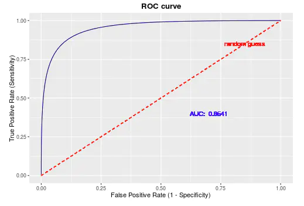

## CMC（用于识别）

- CMC曲线全称是Cumulative Match Characteristic (CMC) curve，也就是累积匹配特征曲线，同ROC曲线Receiver Operating Characteristic (ROC) curve一样，是模式识别系统，如人脸，指纹，虹膜等的重要评价指标，尤其是在生物特征识别系统中，一般同ROC曲线一起给出，能够综合评价出算法的好坏

CMC曲线综合反映了分类器的性能，它的评价指标与现在deep learning中常用的top1 err或top5 err评价指标一样的意思，不同的是这里Rank1 recognition rate表示的是正确率而不是错误率，两者的关系是

- Rank1识别率=1-top1 err

- Rank5识别率=1-top5 err

 

- CMC曲线是算一种top-k的击中概率，主要用来评估闭集中rank的正确率。举个很简单的例子，假如在人脸识别中，底库中有100个人，现在来了1个待识别的人脸（假如label为m1），与底库中的人脸比对后将底库中的人脸按照得分从高到低进行排序，我们发现：

    如果识别结果是m1、m2、m3、m4、m5……，则此时rank-1的正确率为100%；rank-2的正确率也为100%；rank-5的正确率也为100%；
    如果识别结果是m2、m1、m3、m4、m5……，则此时rank-1的正确率为0%；rank-2的正确率为100%；rank-5的正确率也为100%；
    如果识别结果是m2、m3、m4、m5、m1……，则此时rank-1的正确率为0%；rank-2的正确率为0%；rank-5的正确率为100%；

- 同理，当待识别的人脸集合有很多时，则采取取平均值的做法。例如待识别人脸有3个（假如label为m1，m2，m3），同样对每一个人脸都有一个从高到低的得分，

    比如人脸1结果为m1、m2、m3、m4、m5……，人脸2结果为m2、m1、m3、m4、m5……，人脸3结果m3、m1、m2、m4、m5……，则此时rank-1的正确率为（1+1+1）/3=100%；rank-2的正确率也为（1+1+1）/3=100%；rank-5的正确率也为（1+1+1）/3=100%；
    比如人脸1结果为m4、m2、m3、m5、m6……，人脸2结果为m1、m2、m3、m4、m5……，人脸3结果m3、m1、m2、m4、m5……，则此时rank-1的正确率为（0+0+1）/3=33.33%；rank-2的正确率为（0+1+1）/3=66.66%；rank-5的正确率也为（0+1+1）/3=66.66%；

## ROC（用于验证）

ROC全称为`Receiver Operating Characteristic Curve`，中文名字为“受试者工作特征曲线”

 

分析该曲线：

- 横坐标：假阳性率（False Positive Rate，FPR）
  - FPR = FP/N
  - N为真实负样本个数，FP为这N个负样本被分类器预测为正样本的个数
  - N = FP（False Positive） + TN（True Negtive）
  - FP：假阳例，真实值为0，预测值为1
  - TN：真阴例，真实值和预测值都为0
- 纵坐标：真阳性率（True Positive Rate，TPR）
  - TPR = TP/M
  - M为真实正样本个数，TP为这M个正样本被分类器预测为正样本的个数
  - M =  TP（True Positive）+ FN（False Negitive）  
  - TP：真阳例，真实值和预测值都为1
  - FN：假阴例，真实值为1，预测值为0
- 曲线上的每一个点代表：某个阈值下的（FPR,TPR）
  - 对于人脸识别LFW验证集来说
    - 可以把相同人的pair看成正样本，不同人的pair看成负样本
    - FPR：把不同的人分类为同一个人
    - TPR：把相同的人分类为同一个人
  - 所以TPR越大越好（最好为1），FPR越小越好（最好为0）
- AUC（Area under roc Curve）
  - ROC曲线下的面积大小
  - 一般取值在0.5~1之间；AUC值越大，说明该模型的性能越好

## TAR，FAR，FRR，ERR

### FAR

> FAR（False Accept Rate）表示错误接受的比例。所谓的接受就是在进行人脸验证的过程中，两张图像被认为是同一个人

计算方式：

- FAR = (非同人分数 > T) / 非同人(类间)比较次数
- 做人脸验证的时候我们会给出两张图像让算法判断两张图片是不是同一个人的。一般是先将两张图片表示成两个高维的特征向量，然后计算两个特征向量的相似度或者距离。在这里定义FAR时使用的是相似度，公式中分数就是指的相似度。在比较的过程中我们希望同一个人的图像相似度比较高，不同人的相似度比较低。我们会给定一个相似度阈值T，比如0.6, 如果两张图像的相似度大于T我们就认为两张图片是一个人的，如果小于T我们就认为两证图像 是不同人的。但是无论将T设置成什么样值都会有一定得错误率，就是FAR，因为我们提取的图像的特征向量总是不够好，并不总能 满足：同一个人的图像相似度比较高，不同人的相似度比较低。偶尔也会出现不同人的图像的相似度大于给定的阈值T，这样我们就会犯错误接受的错误。FAR就是我们比较不同人的图像时，把其中的图像对当成同一个人图像的比例。我们希望FAR越小越好。
- FAR 错误接受率和FPR假阳性率是一个意思；表示把两个不同的人当成同一个人

### TAR

> TAR（True Accept Rate）表示正确接受的比例。所谓的就是在进行人脸验证的过程中，两张图像被认为是同一个人

计算方式：

- TAR = (同人分数 > T) / 同人(类内)比较次数
- TAR正确接收率和TPR真阳性率是一个意思；表示把同一个人当成同一个人

### FRR

> FRR（False Reject Rate）就是错误拒绝率。就是把相同的人的图像当做不同人

计算方式：

- FRR  = (同人分数 < T) / 同人比较次数
- FRR = 1 - TAR
- FRR错误拒绝率和FNR假阴性率是一个意思；表示把同一个人当成不同人

### ERR

> EER(Equal Error Rate)即等误率。
> EER为 取某个T值时，使得FAR=FRR 时，的FAR或FRR值

分析：

- FAR = FPR  = x
- FRR = 1 - TAR = 1 - TPR = 1 - y
- 即：x = 1 - y   
- 所以画一条经过（0，1）（1，0）的直线，该直线与ROC曲线交点横或纵坐标即为ERR

 

对于人脸验证问题，设定一个相似度阈值T，特征相似度>T，则预测为为真类，否则预测为负类。阈值减小，FNR会减小，即可以识别出更过的真类，但是同时FPR会增大，即会把更多的负类预测为真类。因此可以采用ERR作为性能指标，即通过调整阈值大小，使得FNR=FPR，该点出的阈值T为最优阈值。通过该阈值计算的准确率为人脸验证的准确率ACC。

- ACC = (TP + TN) / (TP + FN + TN + FP)