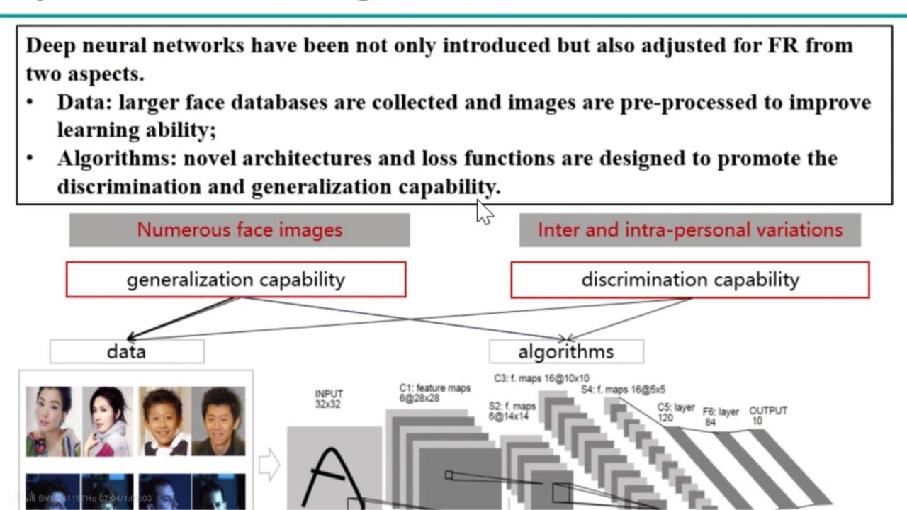
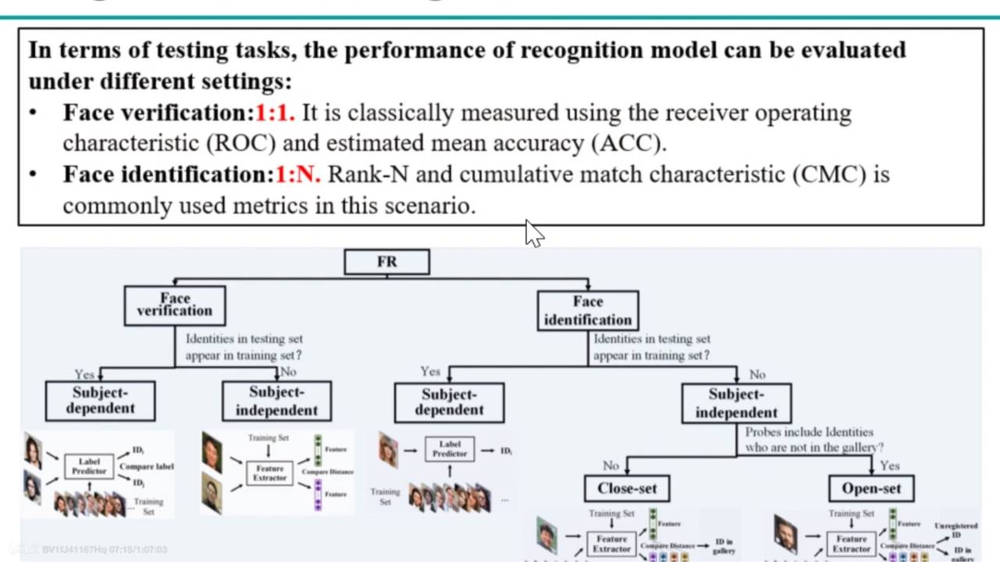
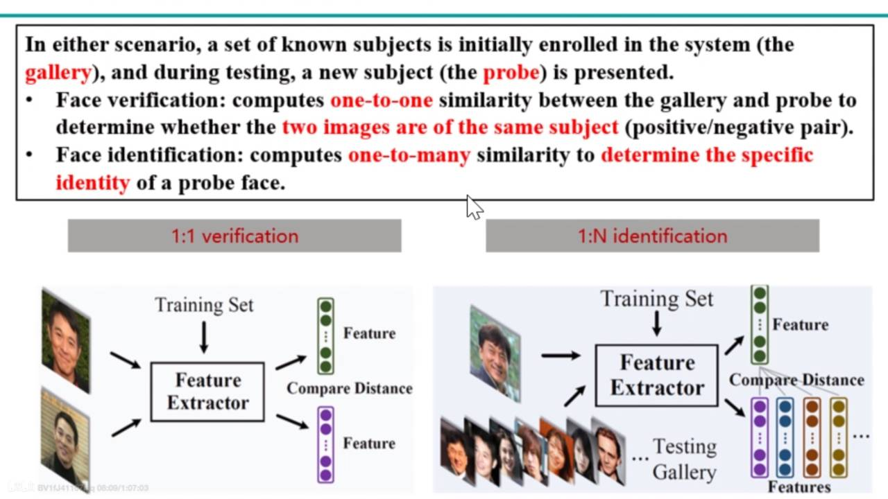
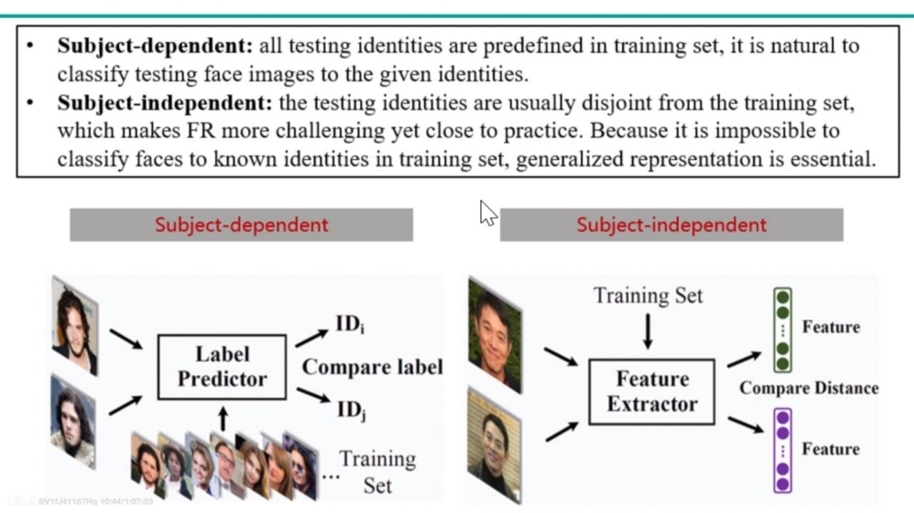
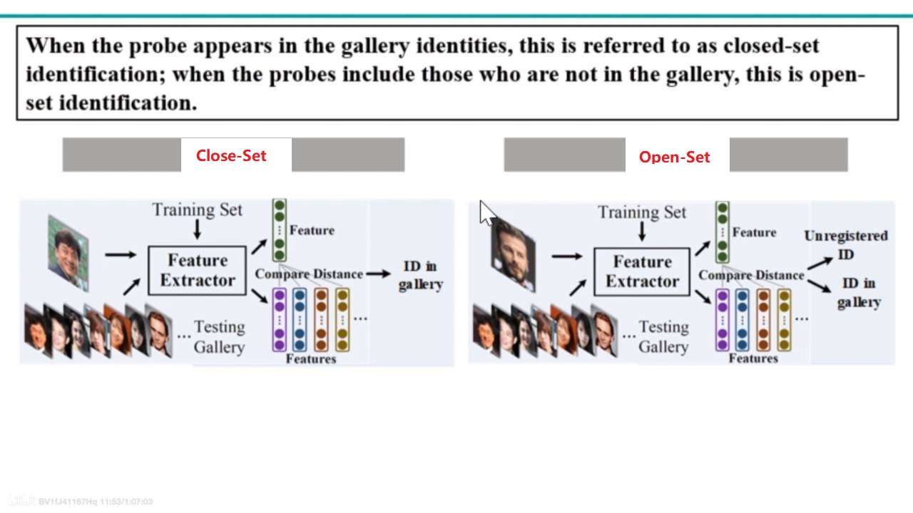
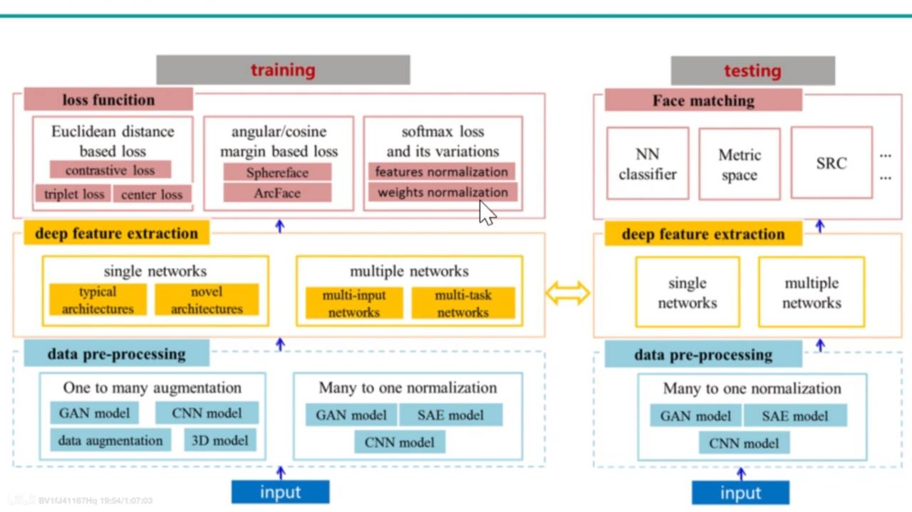
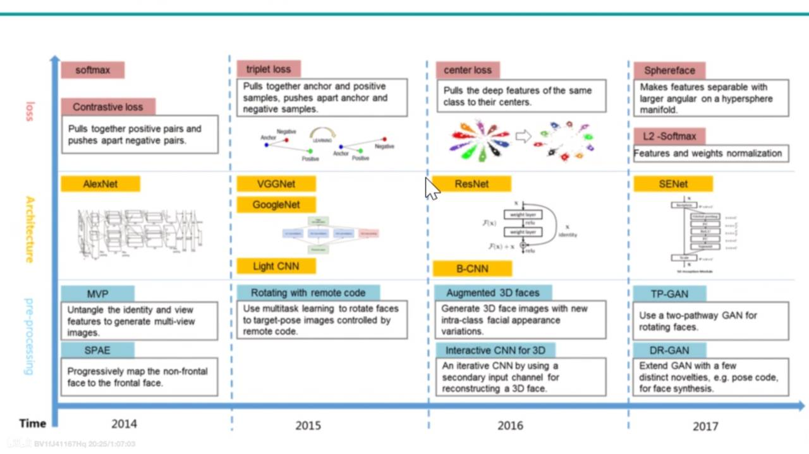

# 简介

人脸识别就是通过人工设计特征提取/神经网络等方式提取人脸的特征(纹理特征，几何特征)来进行识别

深度学习通过海量的人脸数据集学习更好的表达人脸，将人脸图像映射到高维的特征空间，学习样本之间的相似或者不同之处，以此提高人脸识别在非限定场景下的鲁棒性。

- 监控视频下人脸识别流程
  - 视频图像获取
  
  - 图像预处理（人脸检测 -> 人脸特征点定位 -> 人脸归一化）
  
    - 人脸归一化，也叫人脸对齐；目的是实现人脸姿态的矫正，使得网络在不同人脸图像的同一位置学习特征
  
      操作：通过人脸特征点的位置信息通过放射变换（平移，旋转，缩放等）将人脸的特征点映射到标准人脸模板的特征点
  
  - 特征提取
  
    - 将归一化后的人脸图像输入神经网络提取特征
  
  - 特征对比识别
  
    - 对来自不同人脸图像的特征进行相似度计算，对于相似度的度量标准主要有欧氏距离，余弦距离等
      - 余弦距离：cos(X,Y) = ( X * Y ) / ( ||X|| \* ||Y|| )；设置阈值T，当两个样本的余弦距离>T时，判定两个样本属于同一个人，小于等于T时，则判定两个样本不是同一个人
- 影响人脸特征提取及识别准确率的因素
  - 光照条件
  - 人脸姿态
    - 现实监控场景下，摄像头的拍摄角度大多数要高于人脸，存在俯视，仰视，拍摄到人脸图像是侧脸问题。捕获到的人脸可能会具有表情：大笑，愤怒，皱眉等，都会增加人脸识别系统正确识别人脸的难度
  - 遮挡
  - 人脸分辨率
    - 由于高分辨率图像采集设备成本高及早期成像技术的限制，目前分布在大街小巷的监控摄像头的分辨率不高，并且为了使得摄像头的监控范围尽量大面积的覆盖，导致远距离的人脸图像的分辨率低，对人脸识别准确率造成了很大影响

# 人脸识别分类

人脸识别(`face Recognition`)任务一般分成两类：人脸验证：`face verification`，人脸识别：`face identificatioin`

- 人脸验证
  - 人脸验证也称身份验证是1:1任务，验证这个人是不是你？
  - 将检测到的人脸图片和身份证上的照片/数据库保存的人脸图片进行一一对比，判断两张人脸是否属于同一个人
  - 应用：车站人脸识别闸机；人脸手机解锁；网吧老板拿身份证照片和你本人进行比对
- 人脸识别
  - 1:N任务,找出你是谁？跟1:1的A/B两张照片对比最大的区别是A/B,A/C,A/D...多个1:1计算
  - 应用：某公司用了一个打卡系统，该系统录入了公司所有员工的图片；现在你要打卡了，进行人脸识别，系统告诉你，你是小明，小明你好，请进！
  - N:N任务，实际上是基于1:N的算法；比如视频流帧中的人脸识别

# 综述

## 神将网络的学习

- 神经网络模仿人脑的认知能力，通过多层非线性映射实现高层语义的抽象
- 左图可以看到DCNN首先提取像素点信息 -> 边缘信息 -> 物体部分信息 -> 物体的全局信息
- 右图可以看到随着数据集的增多和算法的提升，DCNN在LFW上表现越来越好

 

## Optimize-data and algorithms

为了增强用于人脸识别的深度神经网络的泛化能力（generalization capability）和辨识能力（discrimination capability），目前的工作主要从两方面入手：

- 数据

  - 训练集（增加数据的多样性）
    - 采集更多、更好、更全面的数据
    - 对数据进行预处理，让数据更有多样性（包含多的姿态，多的年龄，多的性别）

  ​          在训练的时候见过这些图片，在测试的时候可能更好地识别出跨年龄，跨姿态的图片

  - 测试集（减少数据的多样性）

    比如有两个图片要进行验证，1个0°，另1个90°，我们可以把90°图片映射到0°，这样可以比对两个正脸图片，使得数据更模板化

- 算法
  - 设计更深的网络
  - 设计更精妙的Loss

 

## Categories of face recognition

> 在测试任务期间，通常用两种设置评估识别模型：
>
> - Face Verification
>
>   - Subject-dependent（测试集是训练集的子集(对于identities来说)）
>     - 输入两张图片比较输出的ID类别即可
>   - Subject-independent
>     - 输入两张图片比较特征向量
>
> - Face Identification
>
>   - Subject-dependent
>
>     - 输入一张probe，输出该图片对应的ID（标签预测）
>
>   - Subject-independent
>
>     - Close-Set（Probe set 是 Gallery set的子集）
>       - 输入一张probe，在进行特征比对后输出对应ID
>
>     - Open-Set
>       - 输入一张probe，在进行特征比对后输出对应ID或者未注册ID

 

### Verification VS Identification

> 人脸识别测试集一般分为Gallery和Probe
>
> Gallery set：
>
> -  数据是事先采集好的，并录在系统里的
>
> Probe set：
>
> - 如果再来一个新的图片，我想要对它和Gallery中数据进行比对，并知道结果，这个新的图片就是Probe

 

### Subject-dependent VS Subject-independent

> 在人脸识别场景中一般都是Subject-independent

 

### Close-Set VS Open-Set

 

### FR Components

  

### FR Trends

 