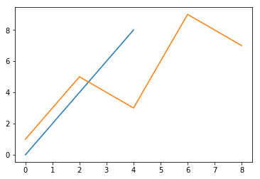
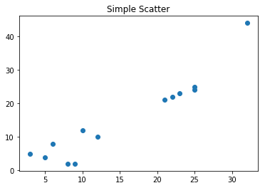
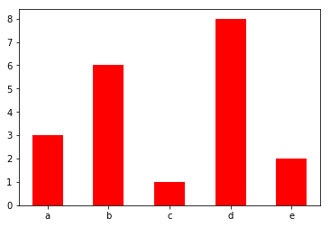
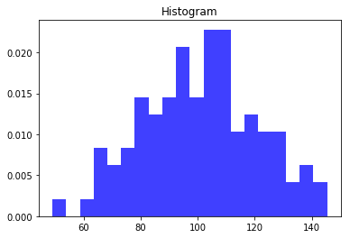
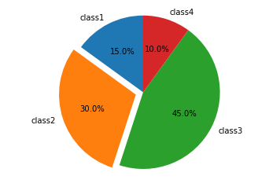

> Matplotlib能够绘制**折线图、散点图、柱状图、直方图、饼图**

# 折线图

- 以折线的上升或下降来表示统计数量的增减变化的统计图

- **特点：能够显示数据的变化趋势，反映事物的变化情况。(变化)**

- api：`plt.plot(x, y)`




# 散点图

- 用两组数据构成多个坐标点，考察坐标点的分布,判断两变量之间是否存在某种关联或总结坐标点的分布模式。

- **特点：判断变量之间是否存在数量关联趋势,展示离群点(分布规律)**

- api：`plt.scatter(x, y)`

  

# 柱状图

- 排列在工作表的列或行中的数据可以绘制到柱状图中。

- **特点：绘制连离散的数据,能够一眼看出各个数据的大小,比较数据之间的差别。(统计/对比)**

- api：plt.bar(x, y,  width, align='center', **kwargs)

  ```
  Parameters:    
  x,y: 需要传递的数据
  
  width : 柱状图的宽度
  
  align : 每个柱状图的位置对齐方式
      {‘center’, ‘edge’}, optional, default: ‘center’
  
  **kwargs :
  color:选择柱状图的颜色
  ```

  

# 直方图

- 由一系列高度不等的纵向条纹或线段表示数据分布的情况。 一般用横轴表示数据范围，纵轴表示分布情况

- **特点：绘制连续性的数据展示一组或者多组数据的分布状况(统计)**

- api：`matplotlib.pyplot.hist(x, bins=None)`

  ```
  Parameters:    
  x : 需要传递的数据
  bins : 组距
  ```

  

# 饼图

- 用于表示不同分类的占比情况，通过弧度大小来对比各种分类。

- **特点：分类数据的占比情况(占比)**

- api：`plt.pie(x, labels=,autopct=,colors)`

  ```
  Parameters:  
  x:数量，自动算百分比
  labels:每部分名称
  autopct:占比显示指定%1.2f%%
  colors:每部分颜色
  ```

